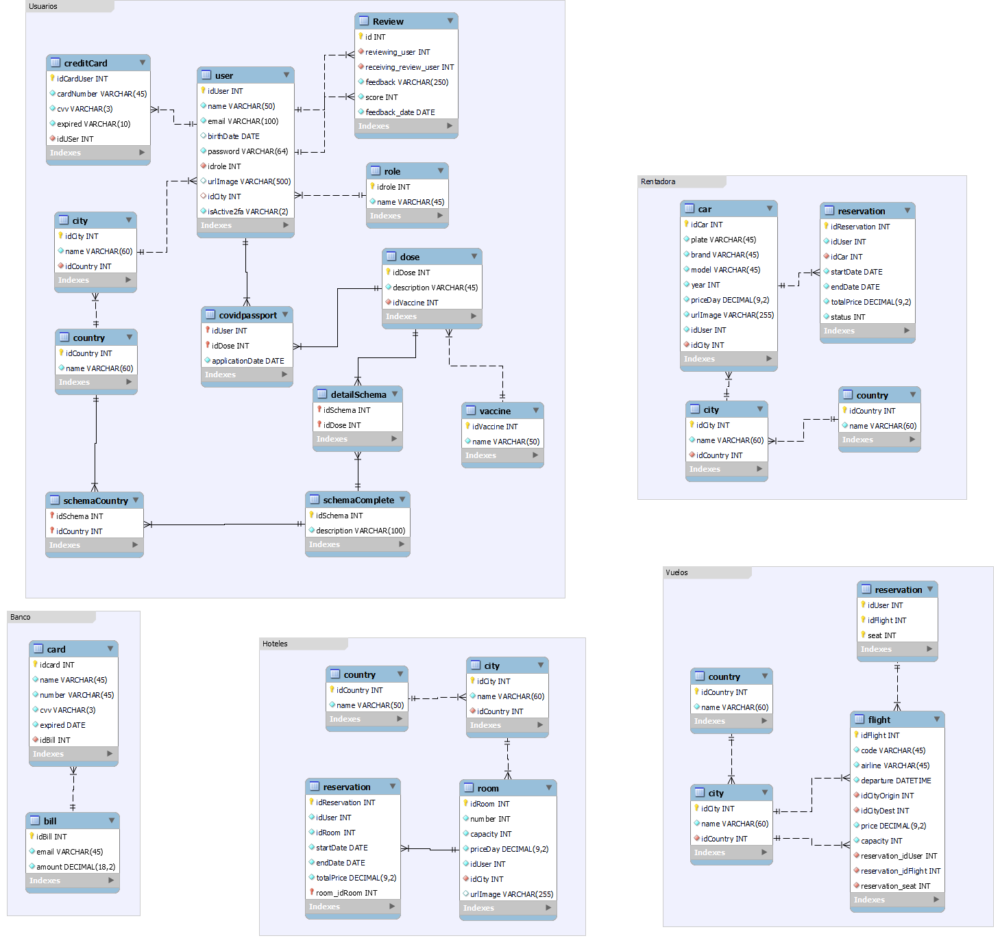

El modelo posee 5 bases de datos principales, una para cada tipo de servicio, una para los usuarios, otra para los hoteles, otra para los autos, la de vuelos y por último la de bancos.

Estas se comunican entre sí por medio del middleware teniendo todas en común el id del usuario que será llevado desde una base a otra para mantener la integridad de los datos y anexarlos por medio de los usuarios.