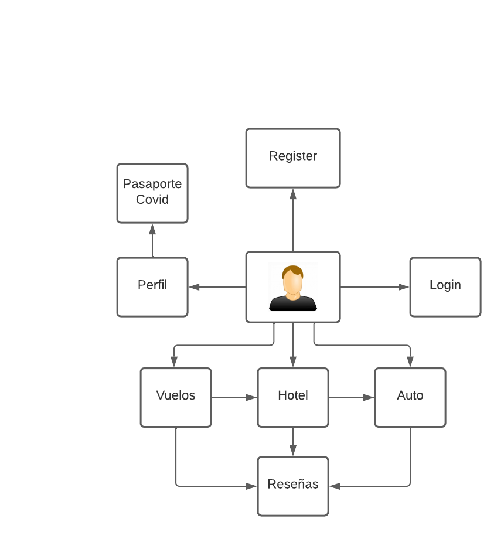

# Análisis UI y UX

El usuario al ingresar puede interactuar directamente con toda la aplicación, puediendo consultar los vuelos, los hoteles o los automoviles incluso en la página inicial, aqui mismo puede iniciar sesión o registrarse, esto permite que el usuario pueda realizar sus reservas de manera rápida y sencilla. evitando clicks innecesarios.
Toda esta información esta separada por categorías para evitar la sobrecarga de información en la página.